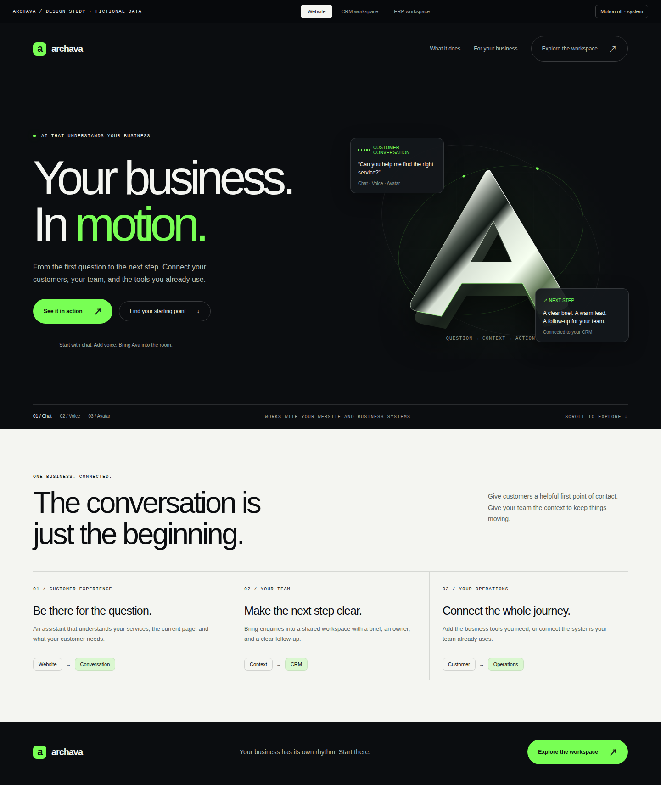
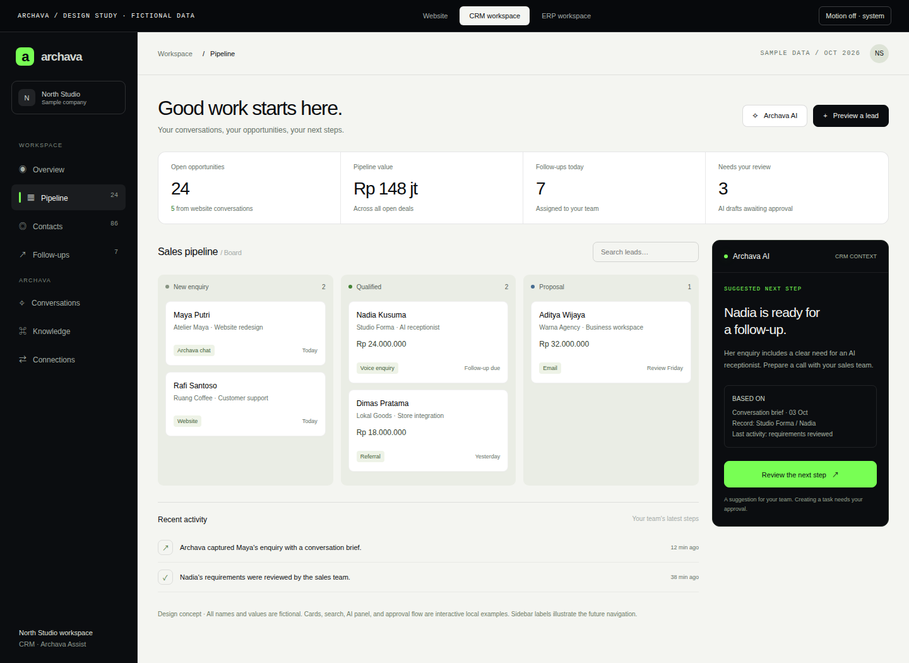
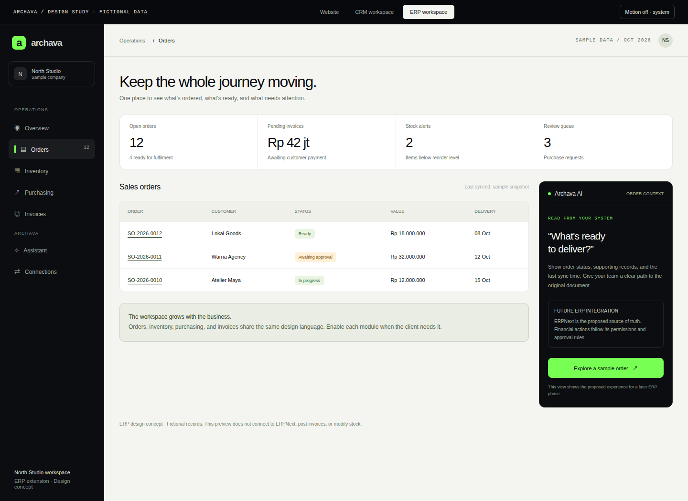

# Archava — Design direction

**Arah:** Your business. In motion.\
**Tanggal riset:** 4 Oktober 2026\
**Cakupan:** website Archava, pengalaman pelanggan, dashboard CRM, dan perluasan ERP.\
**Status:** arah desain; FE awal website dan workspace sudah dibuat dengan data demo lokal. Integrasi CRM/ERP dan layanan AI live tetap membutuhkan implementasi.

**Untuk mencoba FE:** lihat [panduan frontend](docs/FRONTEND.md). Website tersedia di `/archava`, dashboard di `/workspace`, dan modul operations melalui `/workspace?module=erp` pada app web lokal. Preview HTML di bawah tetap menjadi artefak design study awal.

Archava harus terasa seperti bisnis yang mulai bergerak: pelanggan bertanya, kebutuhan menjadi jelas, tim menerima konteks, lalu pekerjaan berlanjut. Website menunjukkan cerita itu dengan visual besar dan motion yang terasa dibuat khusus. Workspace menerjemahkan cerita yang sama menjadi pekerjaan sehari-hari yang jelas, cepat, dan mudah dipelajari.

Targetnya kualitas visual dan detail interaksi sekelas referensi Awwwards. Penilaian award tetap berada di luar kendali produk. Ukuran berhasil kita: orang memahami Archava, ingin mencoba, dan bisa menyelesaikan pekerjaan tanpa bingung.

**Buka [preview interaktif](docs/design-preview.html)** untuk melihat tiga permukaan: Website, CRM workspace, dan ERP workspace. Semua nama, angka, dan tindakan di preview adalah contoh lokal. Preview memakai SVG/CSS dan system fonts; rendering 3D, font final, dan integrasi backend belum dibuat.

## 1. Rasanya seperti apa?

Bayangkan masuk ke halaman graphite dengan headline besar, sebuah monogram A berbahan chrome, garis orbit tipis, dan satu percakapan yang mulai berubah menjadi pekerjaan. Saat scroll, konteks percakapan tersusun menjadi kartu lead, lalu masuk ke workspace. Setelah itu, pengunjung bisa mencoba bagaimana tim membaca brief, melihat peluang, dan menyetujui langkah berikutnya.

Di workspace, visual berubah menjadi bidang terang dengan sidebar graphite. Lime menjadi penanda interaksi dan AI. Record, tugas, nilai transaksi, dan status menjadi pusat perhatian. Perpindahan terasa halus, tetapi tombol dan input selalu langsung merespons.

Karakter utamanya:

- **Editorial:** headline besar, komposisi asimetris, ruang kosong yang terukur.
- **Material:** chrome, bidang graphite, cahaya lime yang tipis, kedalaman dari lapisan.
- **Terhubung:** perpindahan dari percakapan ke record terlihat sebagai satu perjalanan.
- **Jelas:** istilah bisnis, sumber informasi, status, dan langkah berikutnya mudah dibaca.
- **Bisa disesuaikan:** satu sistem visual mendukung brand klien dan modul yang berbeda.

## 2. Apa yang diwarisi dari proyek lu?

Audit dilakukan lewat source, dokumen motion Archcore, dan tampilan build lokal di browser. Detail sumber dan batas pengamatan ada di [catatan riset](docs/design-research.md).

| Proyek               | Yang sudah ada                                                                                               | Yang dibawa ke Archava                                                                                          |
| -------------------- | ------------------------------------------------------------------------------------------------------------ | --------------------------------------------------------------------------------------------------------------- |
| Archcore marketplace | GPU Three.js, empat babak hero mengikuti scroll, portal canvas, katalog horizontal, timeline sticky, marquee | Satu objek utama yang berubah mengikuti cerita; perpindahan babak yang punya tujuan; ritme terang–gelap         |
| ArchavaOnchain       | Portrait hero besar, graphite/lime, grid teknis, parallax, reveal, marquee, feedback status percakapan       | Identitas Archava yang sudah terasa hidup; komposisi besar; animasi yang menjelaskan kondisi asisten            |
| Archava Template     | Starter React/Vite terpisah dengan turunan visual ArchavaOnchain dan mode reduced motion                     | Tempat untuk mengembangkan pengalaman pelanggan sesuai proyek; konfigurasi brand tetap terpisah dari kredensial |

**Jawaban soal “full motion”:** keduanya memang banyak memakai motion, tetapi jenisnya berbeda. Archcore lebih kuat pada adegan 3D dan cerita yang dikendalikan scroll. ArchavaOnchain lebih banyak memakai animasi CSS, portrait, parallax, reveal, dan status UI. Hero portrait-nya bukan model manusia 3D hanya karena nama komponennya `VideoHero`.

Ada dua hal yang perlu kita rapikan saat menerjemahkan DNA itu: headline dan objek tidak boleh berebut ruang baca; aksen lime di atas putih dipakai sebagai bidang atau dekorasi dengan teks gelap. Dekorasi selalu mengikuti keterbacaan.

## 3. Referensi dan keputusan desain

| Referensi                                                                                                    | Pelajaran yang dipakai                                                                                                                                                                         | Penerapan di Archava                                                                                                                                          |
| ------------------------------------------------------------------------------------------------------------ | ---------------------------------------------------------------------------------------------------------------------------------------------------------------------------------------------- | ------------------------------------------------------------------------------------------------------------------------------------------------------------- |
| [Lusion](https://lusion.co/)                                                                                 | Studio membangun pengalaman melalui desain, motion, 3D, dan storytelling; Lusion v3 tercatat sebagai Site of the Year 2023 di [Awwwards](https://www.awwwards.com/websites/sites_of_the_year/) | Satu adegan khas dengan objek brand dan perubahan babak. Loader bukan syarat untuk membaca halaman                                                            |
| [Igloo Inc.](https://www.igloo.inc/) / [Awwwards SOTY](https://www.awwwards.com/websites/sites_of_the_year/) | Referensi art direction untuk objek utama yang membawa identitas; tercatat sebagai SOTY 2024                                                                                                   | Material dan komposisi sebagai inspirasi. Live scene tidak berhasil diverifikasi dalam browser riset ini; detail motion-nya belum menjadi spesifikasi Archava |
| [Linear — UI redesign](https://linear.app/now/how-we-redesigned-the-linear-ui)                               | Hierarki, alignment, sidebar, panel, dan variasi view diuji sebagai satu sistem                                                                                                                | Workspace konsisten untuk board, list, record detail, dan approval; tema terang/gelap berbagi token                                                           |
| [Stripe](https://stripe.com/)                                                                                | Produk bisnis dijelaskan lewat alur dan contoh interface yang konkret                                                                                                                          | Website menunjukkan apa yang terjadi dari pertanyaan sampai pekerjaan; integrasi diperlihatkan melalui manfaatnya                                             |
| [Frappe CRM](https://docs.frappe.io/crm/setup-guide/your-first-steps-with-frappe-crm)                        | Leads, deals, kontak, organisasi, tugas, dan komunikasi sudah mempunyai alur yang bisa dipelajari                                                                                              | Nama dan perilaku record tetap mengikuti fondasi. Archava menambahkan konteks AI di sekitar pekerjaan itu                                                     |

Ini interpretasi desain untuk Archava. Kita membuat layout, copy, monogram, komponen, dan urutan cerita sendiri. Source atau aset situs referensi tidak menjadi bahan template klien.

## 4. Satu identitas, tiga tempat

| Permukaan               | Pengguna                       | Fokus                                                               | Karakter motion                                                                  |
| ----------------------- | ------------------------------ | ------------------------------------------------------------------- | -------------------------------------------------------------------------------- |
| Website Archava         | Pemilik bisnis dan calon klien | Mengerti, melihat contoh, menjadwalkan demo                         | Hero sinematik, cerita scroll, perpindahan komposisi                             |
| Website klien + asisten | Pelanggan bisnis klien         | Mendapat jawaban, memilih layanan, melakukan tindakan yang tersedia | Percakapan, status asisten, perubahan panel, feedback hasil                      |
| Workspace CRM/ERP       | Owner, staf, admin             | Melihat pekerjaan, mengelola record, meninjau tindakan AI           | Panel singkat, perpindahan view, highlight perubahan, feedback yang bisa dilacak |

**Archava Workspace** adalah nama kerja untuk dashboard dalam dokumen ini, bukan tier harga baru. CRM dan ERP adalah modul sesuai kebutuhan klien. Presence tetap Chat, Voice, atau Human; avatar tidak menjadi syarat untuk memakai workspace.

## 5. Sistem visual

### Warna

Lime utama mempertahankan `#78FF54` dari ArchavaOnchain. Warna dasar berasal dari neutral graphite dan paper. Warna status mempunyai tugas sendiri dan tetap disertai label.

| Token                 | Nilai awal | Pemakaian                                                   |
| --------------------- | ---------- | ----------------------------------------------------------- |
| `surface.ink`         | `#0B0D10`  | Website gelap, sidebar, panel AI                            |
| `surface.panel`       | `#15181C`  | Kartu pada bidang gelap                                     |
| `surface.paper`       | `#F4F5F1`  | Canvas workspace terang, bagian penjelasan website          |
| `surface.card`        | `#FFFFFF`  | Record, form, tabel pada tema terang                        |
| `brand.signal`        | `#78FF54`  | CTA, penanda asisten, garis penghubung                      |
| `text.onDark`         | `#F4F5F1`  | Copy di atas graphite                                       |
| `text.secondaryDark`  | `#A4ABA8`  | Copy sekunder di atas graphite                              |
| `text.onLight`        | `#0B0D10`  | Copy di atas paper                                          |
| `text.secondaryLight` | `#566159`  | Copy sekunder di atas paper                                 |
| `border.onDark`       | putih 12%  | Pemisah dekoratif; batas control memakai kontras lebih kuat |
| `border.onLight`      | ink 15%    | Pemisah dekoratif; batas control memakai kontras lebih kuat |
| `status.success`      | `#27771C`  | Hasil berhasil dengan label                                 |
| `status.warning`      | `#845B15`  | Perlu review atau menunggu, dengan label                    |
| `status.error`        | `#B42318`  | Error yang dapat ditindaklanjuti                            |

CTA lime memakai teks ink. Teks kecil tidak memakai lime di atas paper. Nilai final diuji kontrasnya pada kombinasi tema sebenarnya.

### Tipografi

- **Space Grotesk:** headline website, judul penting, angka ringkasan.
- **DM Sans:** navigasi, body copy, record, form, tabel.
- **JetBrains Mono:** metadata singkat seperti ID, waktu, dan caption teknis.

Self-host font yang lisensinya sudah diperiksa; batasi weight yang dimuat. Mono tidak menjadi font seluruh dashboard.

| Elemen          | Desktop  | Mobile  | Catatan                                                      |
| --------------- | -------- | ------- | ------------------------------------------------------------ |
| Hero            | 88–144px | 48–64px | `clamp`, maksimal tiga baris; ruang teks terpisah dari objek |
| Judul section   | 48–72px  | 32–44px | Satu gagasan per judul                                       |
| Judul workspace | 28–32px  | 24–28px | Mudah dipindai tanpa memakan tinggi layar                    |
| Body website    | 16–18px  | 16px    | Line-height sekitar 1.6                                      |
| Body workspace  | 14px     | 14–16px | Row data padat tetap terbaca                                 |
| Metadata        | 12px     | 12px    | Ukuran kecil preview bukan ukuran final produk               |

### Grid, bentuk, dan kedalaman

- Website: 12 kolom, max-width 1440px, gutter desktop 64–80px, mobile 20–24px.
- Workspace: sidebar 216–240px, header 64–68px, konten dengan padding 24–32px.
- Spacing mengikuti kelipatan 4px. Tabel normal menggunakan tinggi row 44–48px.
- Radius: control 8px, kartu 12px, dialog 16px, kapsul hanya pada CTA/navigasi tertentu.
- Border halus dan elevation membentuk hierarki. Record operasional memakai bidang solid agar isi stabil dan terbaca.
- Chrome menjadi aset utama website. Workspace mendapat aksen material seperlunya pada brand atau empty state.

## 6. Website: perjalanan pengunjung

### Pembuka

Navigation: wordmark Archava, What it does, Solutions, How it works, dan CTA **Book a demo**. Pada versi Indonesia: **Jadwalkan demo**. CTA **See it in action** membuka demo yang memang tersedia; jika demo hanya simulasi, labelnya menjelaskan itu.

Hero utama:

> **Your business.**\
> **In motion.**

Supporting copy:

> From the first question to the next step. Connect your customers, your team, and the tools you already use.

Alternatif Indonesia untuk implementasi lokal:

> **Bisnis lu, terus bergerak.**\
> Dari pertanyaan pelanggan sampai pekerjaan tim. Archava menghubungkan percakapan dengan langkah berikutnya.

Bahasa informal ini untuk konsep milik founder. Copy produksi klien memakai tone brand klien; halaman Indonesia boleh menggunakan “bisnis Anda” sesuai audiens.

Monogram A chrome mengisi area visual. Tiga jejak kecil menjelaskan Customer question → Clear context → Next step. Chat/Voice/Avatar terlihat sebagai pilihan, bukan tiga paket yang memaksa pengunjung membeli avatar.

### Urutan halaman

| Bagian                  | Yang harus dipahami                                                     | Bentuk visual / interaksi                                                     |
| ----------------------- | ----------------------------------------------------------------------- | ----------------------------------------------------------------------------- |
| 1. Hero                 | Archava memahami bisnis dan membantu langkah berikutnya                 | Objek utama, headline, dua CTA; copy siap sebelum scene berat                 |
| 2. Conversation → work  | Percakapan pelanggan bisa menjadi konteks pekerjaan                     | Tiga babak: pertanyaan, brief, record; satu section sticky desktop            |
| 3. Choose your presence | Mulai dari chat, tambah voice/avatar bila perlu                         | Selector mengganti satu preview dengan ukuran tetap                           |
| 4. Your team            | Tim menerima lead, konteks, dan tugas yang jelas                        | Potongan workspace yang dapat dicoba dengan data fiktif                       |
| 5. Your systems         | Klien bisa memakai sistem baru atau menghubungkan sistem yang sudah ada | Dua jalur visual: existing systems / new workspace                            |
| 6. Solutions            | Modul dapat mengikuti kebutuhan industri                                | Kartu use case dengan contoh nyata; belum ada klaim siap untuk semua industri |
| 7. How we work          | Discovery → konfigurasi → integrasi → peluncuran → perawatan            | Timeline singkat dengan hasil setiap tahap                                    |
| 8. FAQ + CTA            | Mengetahui lingkup dan cara mulai                                       | FAQ biasa, CTA jadwalkan demo, wordmark besar sebagai penutup                 |

Logo klien, testimoni, metrik hasil, dan studi kasus hanya muncul saat bukti serta izin pemakaiannya tersedia. Website awal bisa menjelaskan alur memakai demonstrasi fiktif yang diberi label.

### Adegan khas: percakapan menjadi pekerjaan

Desktop memakai satu section sekitar 220–280vh untuk tiga babak; durasi mengikuti scroll, bukan timer. Pengunjung tetap dapat melompati ke bagian berikutnya melalui navigation.

| Progres | Perubahan visual                                                                   | Narasi                           |
| ------- | ---------------------------------------------------------------------------------- | -------------------------------- |
| 0–30%   | Monogram A dan kartu pertanyaan berada di dua lapisan; orbit menunjuk konteks      | “Be there for the question.”     |
| 30–65%  | Kartu pertanyaan menjadi brief; object bergerak ke sisi agar record mendapat ruang | “Make the next step clear.”      |
| 65–100% | Brief masuk ke preview CRM; chrome menyusut menjadi mark kecil di sidebar          | “Keep the whole journey moving.” |

Pada mobile, babak menjadi tiga blok vertikal dengan gambar/scene ringan. Dalam reduced motion, tiga keadaan akhir langsung terlihat. Transformasi ini menjelaskan kesinambungan antara website dan workspace.

## 7. CRM workspace: pekerjaan yang mudah dipahami

**CRM** di sini menyimpan orang yang tertarik, perusahaan mereka, peluang penjualan, percakapan, dan tugas follow-up. **Pipeline** adalah tahapan peluang, misalnya New enquiry → Qualified → Proposal → Won/Lost. Owner dapat menyesuaikannya dengan proses bisnis.

### Struktur utama

Sidebar: Overview, Pipeline, Contacts, Follow-ups. Kelompok Archava: Conversations, Knowledge, Connections. Menu mengikuti modul dan izin role. ERP tidak muncul untuk klien CRM-only.

Main header: workspace/company, breadcrumb, pencarian, dan akun pengguna. Status koneksi berada dekat informasi yang dipengaruhinya. Label “synced” berasal dari sinkronisasi berhasil, bukan animasi dekoratif.

Konten utama:

1. Judul konteks dan satu tindakan utama.
2. Ringkasan terbatas: peluang terbuka, nilai pipeline, follow-up jatuh tempo, tindakan perlu review.
3. Board/list sesuai pekerjaan; pilihan view mempertahankan filter.
4. Detail record di panel samping dengan URL/state yang dapat dibuka kembali.
5. Panel Archava AI yang dapat dibuka atau ditutup tanpa kehilangan record aktif.
6. Activity log yang membedakan saran AI, tindakan pengguna, dan hasil sistem.

### Enam layar pertama

| Layar                | Isi penting                                        | Hasil bagi pengguna                                     |
| -------------------- | -------------------------------------------------- | ------------------------------------------------------- |
| Overview             | Tugas hari ini, peluang, review queue              | Tahu mulai dari mana                                    |
| Pipeline             | Board/list, filter, owner, nilai, status           | Tahu siapa membutuhkan follow-up                        |
| Contact/deal detail  | Informasi, timeline, brief, tugas                  | Tidak perlu mencari konteks di banyak tempat            |
| Conversations        | Percakapan, sumber, handoff, record terkait        | Bisa melanjutkan komunikasi pelanggan                   |
| AI review            | Proposal perubahan, alasan, detail, approve/cancel | Mengerti apa yang akan terjadi                          |
| Connections/settings | Sistem terhubung, status, role, konfigurasi        | Bisa mengelola workspace tanpa melihat rahasia provider |

### AI yang terasa menjadi bagian pekerjaan

Panel AI menunjukkan konteks record yang sedang dibaca, hasil ringkas, sumber pendukung, dan tindakan berikutnya. Setiap permintaan perubahan memperlihatkan record tujuan, nilai yang berubah, owner, serta kebutuhan approval.

Contoh: “Nadia sudah menjelaskan kebutuhan resepsionis AI. Siapkan follow-up untuk tim sales.” Pengguna membuka detail tugas, memeriksa owner dan tanggal, lalu menyetujui. Timeline baru menampilkan berhasil setelah executor mengonfirmasi hasil. Jika gagal, pengguna mendapat alasan dan pilihan yang relevan.

Animasi hanya mengikuti status yang nyata. UI “thinking”, “listening”, “saving”, dan “completed” berasal dari state masing-masing. Ringkasan AI tidak menjadikan data lama sebagai ketersediaan atau saldo terbaru.

### State wajib sejak desain awal

Setiap layar punya loading, empty, populated, error, permission-denied, dan stale/offline state. Tambahkan pending-approval dan partial-failure jika alur mengubah sistem eksternal. Form menyimpan input pengguna saat error dan menunjukkan error dekat field.

Jumlah, nilai uang, tanggal, dan timezone mengikuti sumber serta locale klien. Preview fiktif tidak menjadi pricebook atau data penjualan Archava.

## 8. ERP: bahasa visual yang sama, scope bertahap

**ERP** membantu pekerjaan seperti pesanan, invoice, pembelian, dan stok. Dashboard menggunakan grid, typography, tabel, panel detail, dan pola approval yang sama dengan CRM. Kedalaman datanya bertambah sesuai modul.

Baseline desain: sales orders, invoice status, inventory overview, purchase requests, dan document detail. Akuntansi, perpajakan, payroll, multi-company, serta modul khusus industri memerlukan desain dan implementasi sesuai proses klien.

Pada fase pertama, AI ERP membantu membaca status dan menemukan dokumen. Tindakan seperti submit/cancel invoice, perubahan stok, dan pembayaran mengikuti otorisasi serta lifecycle sistem sumber; prototipe tidak menganggapnya sudah bisa dilakukan.

ERPNext tetap source of truth untuk modul ERP. Archava memperlihatkan data, konteks, asal record, waktu sinkronisasi, dan jalur ke dokumen asli. Menghubungkan CRM dan ERP tidak menjamin seluruh data atau custom field otomatis sama.

## 9. Motion specification

Motion adalah bagian dari sistem desain. Setiap pola mempunyai pemicu, durasi, hasil akhir, dan fallback.

| Pola                 | Pemicu                        | Nilai awal                                               | Reduced motion            |
| -------------------- | ----------------------------- | -------------------------------------------------------- | ------------------------- |
| Hero introduction    | Halaman tersedia              | 600–900ms, translateY 16–24px, stagger maksimal 80ms     | Konten langsung tampil    |
| Objek brand          | Scene terlihat                | Orbit lembut; pointer tilt maksimal 4°, satu scene aktif | Frame statis              |
| Perpindahan babak    | Progres scroll                | Scrub tiga tahap, headline dan objek punya area terpisah | Tiga blok statis          |
| Presence selector    | Click/tap                     | Crossfade 180–240ms, ukuran panel tetap                  | Pergantian langsung       |
| CTA hover/press      | Pointer/keyboard              | Lift 2px / press 1px, 120–180ms                          | Warna/focus saja          |
| Workspace navigation | Route/view berganti           | Fade + translate 4px, 120–180ms; sidebar stabil          | Pergantian langsung       |
| Record panel         | Record dipilih                | TranslateX 12–20px, 220–280ms                            | Panel langsung tampil     |
| Filter/reorder       | Data view berubah             | Layout transition 150–200ms                              | Posisi langsung berubah   |
| Saved/failed action  | Backend mengembalikan hasil   | Highlight singkat 160–220ms + pesan                      | Pesan dan perubahan label |
| Assistant state      | Status sesi/pekerjaan berubah | Aktivitas kecil lokal; hentikan saat idle                | Label state statis        |
| Chart update         | Dataset baru valid            | Maksimal 250ms tanpa animasi ulang seluruh chart         | Nilai akhir langsung      |

Easing dasar: `cubic-bezier(0.16, 1, 0.3, 1)` untuk masuk; exit lebih pendek daripada enter. Semua nilai merupakan keputusan awal untuk diuji, bukan angka hasil benchmark.

Website boleh memiliki satu marquee yang dapat dihentikan dan tidak memuat informasi eksklusif. Workspace memakai gerak hanya saat state berubah atau aktivitas sedang berlangsung. Scroll dashboard tetap normal; pengguna tidak menunggu intro untuk mencari record atau mengetik.

## 10. Mobile dan aksesibilitas

- Website tetap terbaca di 360px; CTA tidak tertutup art. Scene berat ditunda atau diganti poster/SVG.
- Workspace menggunakan navigation yang bisa dibuka lewat tombol. List menjadi default mobile; board yang memerlukan geser mempunyai alternatif list.
- Record/AI panel menjadi sheet/dialog. Focus masuk ke panel dan kembali ke pemicunya ketika ditutup; Escape dan tombol close berfungsi.
- Area touch utama minimal 44×44px sebagai standar desain Archava.
- Status selalu mempunyai teks/icon; warna bukan satu-satunya cara mengenali keadaan.
- Chart mempunyai ringkasan teks/table yang bisa dibaca dan dipakai untuk mengambil keputusan.
- Dukung `prefers-reduced-motion` dan pengaturan motion manual. Pilihan sistem untuk mengurangi motion dihormati.
- Konten, form, serta CTA bekerja sebelum scene tambahan selesai dimuat. Audio UI dimulai dari off dan memerlukan pilihan pengguna.
- Review kontras, keyboard, zoom, pembaca layar, focus, dan responsivitas dilakukan pada implementasi sebenarnya.

Dasar teknis: [MDN reduced motion](https://developer.mozilla.org/en-US/docs/Web/CSS/Reference/At-rules/@media/prefers-reduced-motion) dan [W3C animation from interactions](https://www.w3.org/WAI/WCAG22/Understanding/animation-from-interactions.html). Ini kebutuhan produk, bukan klaim sertifikasi aksesibilitas.

## 11. Cara membangunnya supaya maintenance masuk akal

Desain ini tidak mengharuskan kita mengganti seluruh frontend Frappe/ERPNext pada hari pertama.

| Fase                     | Implementasi                                                                                   | Mengapa                                                                |
| ------------------------ | ---------------------------------------------------------------------------------------------- | ---------------------------------------------------------------------- |
| 0. Design study          | Dokumen, preview offline, screenshot, aturan komponen/motion                                   | Menyatukan arah website dan produk sebelum biaya implementasi membesar |
| 1. Website + CRM standar | Bangun website Archava; konfigurasi brand, field, status, dan akses Frappe CRM                 | Fondasi operasional bisa dipelajari dan dirawat lebih cepat            |
| 2. Workspace Archava     | Tambah shell dan layar bernilai tinggi: overview, conversations, AI review; API adapter ke CRM | Visual khas mulai hadir tanpa mengulang semua form dan record engine   |
| 3. Perluasan ERP         | Tambah modul yang diperlukan; gunakan native views untuk dokumen yang belum punya UI Archava   | Menjaga cakupan tetap sesuai kebutuhan klien                           |
| 4. Preset industri       | Konfigurasi modul, istilah, workflow, theme, dan adapter                                       | Template digunakan ulang tanpa fork source baru untuk setiap brand     |

[Custom branding Frappe CRM](https://docs.frappe.io/crm/custom-branding) menyediakan nama, logo, dan favicon. Itu belum mengubah seluruh UI menjadi konsep dalam preview. Mewujudkan workspace khusus membutuhkan pekerjaan frontend, integrasi, state, permissions, dan pengujian tersendiri. [REST API Frappe](https://docs.frappe.io/framework/user/en/api/rest) adalah jalur integrasi yang diusulkan.

Untuk frontend React yang dipilih pada tahap implementasi: CSS untuk feedback sederhana; [Motion](https://motion.dev/docs/react) untuk panel, layout, dan state; [GSAP ScrollTrigger](https://gsap.com/docs/v3/Plugins/ScrollTrigger/) hanya untuk adegan website yang memerlukan timeline scroll. Satu properti animasi mempunyai satu pengendali; kedua library tidak mengendalikan transform elemen yang sama.

Three.js/scene 3D menjadi tambahan website dan dimuat terpisah. Scene mempunyai cleanup, frame statis, batas pixel ratio, dan berhenti render saat tidak terlihat. Native browser transition bisa dipakai dengan [View Transition API](https://developer.chrome.com/docs/web-platform/view-transitions/) jika didukung, dengan fallback biasa.

Stack tersebut adalah usulan. Repo platform saat ini memiliki web app TypeScript/esbuild; starter terpisah memakai React/Vite. Dokumen ini tidak mengubah dependencies, memindahkan framework, menghubungkan provider, atau menjalankan deployment.

## 12. Template dan brand klien

Sistem visual menggunakan token semantik: surface, text, border, accent, status, spacing, typography, dan motion. Brand klien mengganti tema dan aset melalui konfigurasi yang divalidasi. Role dan modul mengendalikan navigasi serta fitur yang terlihat; otorisasi tetap ditegakkan server.

Website klien mengikuti identitas dan kebutuhan mereka. Chrome/lime Archava dapat hadir dalam widget atau identitas produk sesuai kontrak, tanpa memaksa rumah sakit, hotel, atau toko memakai aesthetic yang sama. Chat, Voice, dan Human memakai pola dasar interaksi yang konsisten.

Satu master design system digunakan ulang. Preset industri berisi konfigurasi dan workflow; perubahan brand tidak membuat template atau repository fork baru. Custom source tetap mempertimbangkan lisensi fondasi, terutama jika mengubah software GPL/AGPL.

## 13. Budget performa dan standar hasil

Target produksi mengacu pada [Core Web Vitals](https://web.dev/articles/vitals): **LCP ≤ 2,5 detik, INP ≤ 200ms, CLS ≤ 0,1**, dievaluasi pada percentile ke-75 mobile dan desktop. Angka ini target; preview dan produk belum dinyatakan lolos pengukuran tersebut.

Budget awal milik Archava untuk website: hero poster sekitar ≤250KB, fonts awal sekitar ≤150KB, JavaScript awal terkompresi sekitar ≤250KB. Scene 3D terpisah dari bundle awal dan baru diaktifkan jika hasil pengujian perangkat sasaran mendukungnya. Target gerak 60fps pada perangkat referensi; turunkan kualitas jika tidak tercapai.

Workspace tidak memuat scene website. Animasi memakai transform/opacity bila cocok, dialog/table tidak mengalami layout shift saat data tiba, dan virtualisasi dipertimbangkan untuk dataset besar. Budget workspace ditetapkan lagi setelah library serta cakupan layar dipilih.

Review desain dinyatakan cukup konkret ketika:

- Website menjelaskan Archava dalam satu layar pembuka dan satu alur contoh.
- Website dan CRM punya identitas yang nyambung, dengan pola navigasi yang sesuai pekerjaan masing-masing.
- Prototype desktop/mobile menunjukkan record, AI proposal, approval, dan hasil dengan status jelas.
- Semua angka contoh diberi konteks fiktif; fitur yang direncanakan tidak dipresentasikan sebagai layanan live.
- Mode reduced motion tetap menyampaikan cerita dan seluruh tindakan penting.
- Hand-off memuat tokens, komponen, state, motion, aksesibilitas, dan batas integrasi.

## 14. Artefak review

- [Preview interaktif](docs/design-preview.html): ganti permukaan lewat tab; cari lead; buka record; buka/tutup AI panel; review dan setujui tugas contoh; buka order contoh; matikan motion.
- [Catatan riset](docs/design-research.md): sumber, audit motion, temuan, dan batas verifikasi.
- [Website desktop](docs/design/website-desktop.png), [CRM desktop](docs/design/crm-desktop.png), [ERP desktop](docs/design/erp-desktop.png), [website mobile](docs/design/website-mobile.png), [CRM mobile](docs/design/crm-mobile.png), [ERP mobile](docs/design/erp-mobile.png).

Preview sudah diperiksa di Chromium pada lebar 360–1920px, termasuk keyboard tab/dialog, pencarian, proposal/approval contoh, dan reduced motion. Detail hasil ada di [catatan verifikasi](docs/design-research.md#verifikasi-preview-lokal). Buka file HTML langsung di browser; preview tidak memerlukan server atau akun provider.

### Website concept

### CRM concept

### ERP concept

