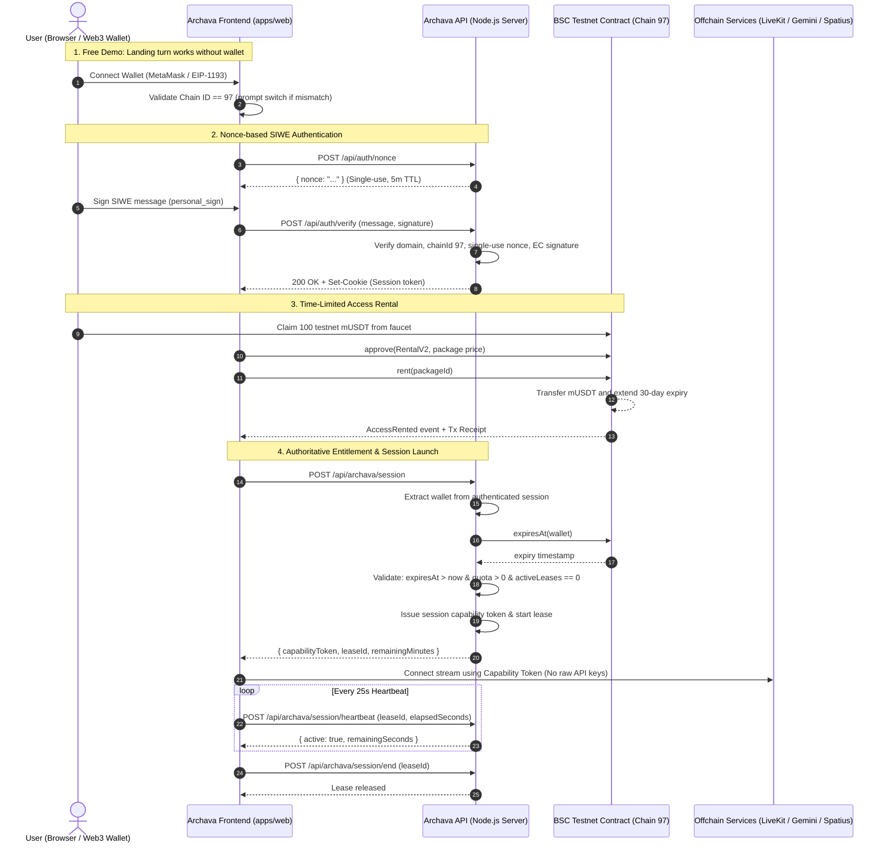

# Archava Platform — BNB Smart Chain (BSC) Testnet Access Rental Flow

## 1. Overview & Product Model

Archava provides AI-driven digital human avatars, conversational agents, and deterministic tenant knowledge.

### Payment & Entitlement Separation

- **Onchain Settlement (BSC Testnet, Chain ID 97):**
  - Uses **Archava Mock USDT (mUSDT)**, a six-decimal test token with no real-world value.
  - Enforces package pricing and records package ID plus 30-day access expiry.
  - Provides a once-per-wallet faucet for hackathon demos.
  - Implements pause controls and owner-controlled token withdrawals.
- **Offchain Execution & Orchestration:**
  - Gemini Live model inference, Spatius avatar rendering, LiveKit audio/video transport, minute usage tracking, concurrency session limits, and provider API keys remain **strictly offchain**.
  - Provider credentials and platform secrets are never stored onchain or leaked into browser client bundles.

---

## 2. Architecture & Trust Boundaries



### Trust Boundary Principles

1. **Never Trust Browser Identity:** Wallet addresses sent in body or headers are never treated as authenticated identity. Authentication requires cryptographic verification of a SIWE message against a server-generated single-use nonce.
2. **Authoritative Onchain State:** Access expiry is read authoritatively from the BSC contract (`expiresAt(wallet)`) by the backend. A transaction receipt or frontend claim alone is never sufficient to grant access.
3. **Fail-Closed Design:** In the event of an RPC timeout, contract read error, or malformed state, the backend rejects access with `503 ACCESS_CHECK_UNAVAILABLE`.
4. **Provider Isolation:** Provider keys for LiveKit, Gemini Live, and Spatius stay strictly server-side. The client only receives a temporary `capabilityToken` tied to a monitored session lease.

---

## 3. Smart Contracts (Rental V2)

`ArchavaMockUSDT` is deployed at `0xd63574ac426169cda5495e1e196bf64d124267d0`. It is an Archava test token, not official Tether USDT. Its `faucet()` gives each wallet 100 mUSDT once.

`ArchavaRentalV2` is deployed at `0xefaacd259136d40cd26a8672697b591c1f84200c` and uses that token address. The UI submits `approve` and waits for confirmation before calling `rent(packageId)`. Access lasts 30 days and extends from the current expiry while active.

The rupiah prices are product references. Testnet payment uses valueless mock tokens at a fixed demo conversion of 1 mUSDT = Rp16,000.

| Package | Display price |       Payment | Conversation quota | Access validity |
| :------ | ------------: | ------------: | -----------------: | --------------: |
| Starter |      Rp79,000 |  4.9375 mUSDT |         60 minutes |         30 days |
| Pro     |     Rp299,000 | 18.6875 mUSDT |        300 minutes |         30 days |

Conversation minutes and active-session leases are metered offchain. The contract stores access expiry and the most recently purchased package ID.

---

## 4. Local Development & Testing

### 1. Compile Contracts

```bash
pnpm --filter @archava/contracts build
```

### 2. Run Foundry Contract Tests

```bash
pnpm --filter @archava/contracts test
```

Foundry tests cover both contract versions, including:

- Zero and unsupported durations
- Insufficient and excess payment rejection
- First-time rental, active extensions, and post-expiry renewals
- Event emissions (`AccessRented`, `PackageConfigured`, `PackageRemoved`, `FundsWithdrawn`)
- Emergency pause enforcement
- Unauthorized administrative calls
- Boundary timestamp conditions (`block.timestamp == expiresAt`)
- Direct deposit rejection (`receive` and `fallback`)

### 3. Run Monorepo Gates

```bash
# Run all Vitest unit and integration tests (including rental client, SIWE auth, and API)
pnpm test

# Run full verify pipeline (install, structure, lint, typecheck, test, build)
pnpm verify
```

---

## 5. Deploying to BNB Smart Chain Testnet

### Prerequisites

1. **Acquire tBNB:**
   - Official BNB Chain Faucet: [https://testnet.bnbchain.org/faucet-smart](https://testnet.bnbchain.org/faucet-smart)
   - Alternative faucet: [https://discord.gg/bnbchain](https://discord.gg/bnbchain)
2. **Environment Variables:**
   Create `.env` in the repository root (do **never** commit real private keys):
   ```bash
   ARCHAVA_CHAIN_ID=97
   BSC_TESTNET_RPC_URL=https://data-seed-prebsc-1-s1.binance.org:8545/
   BSC_DEPLOYER_PRIVATE_KEY=0x<YOUR_PRIVATE_KEY>
   BSCSCAN_API_KEY=<OPTIONAL_BSCSCAN_API_KEY>
   ```

### Deployment Command

Run the safety-checked two-contract V2 deployment script:

```bash
pnpm --filter @archava/contracts deploy:v2
```

#### Built-in Deployment Safeguards

1. **Chain ID Verification:** Verifies the connected RPC is strictly chain ID 97.
2. **Deployer Balance Check:** Validates that the deployer has sufficient tBNB balance to pay for gas before submitting transactions.
3. **No Secret Leakage:** The script never prints private keys.
4. **Artifact Generation:** Generates `packages/contracts/deployments/bscTestnetV2.json` with both addresses, transaction hashes, blocks, ABIs, constructor arguments, and package specifications.

### Optional Contract Verification

To verify the contract on BscScan:

```bash
pnpm --filter @archava/contracts verify:contract
```

### Configuring the Web Application

The current deployment addresses are configured in the root `.env`:

```bash
ARCHAVA_RENTAL_V2_CONTRACT_ADDRESS=0xefaacd259136d40cd26a8672697b591c1f84200c
ARCHAVA_MOCK_USDT_CONTRACT_ADDRESS=0xd63574ac426169cda5495e1e196bf64d124267d0
```

Start the web development server:

```bash
pnpm dev
# Open http://localhost:4173
```

The server loads the root `.env` automatically when it exists. Keep testnet tBNB in the wallet for gas, claim mUSDT from the page, then approve and buy a package.

---

## 6. Stable Error Codes

The API and rental client return stable, typed error codes:

| Error Code                 | HTTP Status | Description                                                                  |
| :------------------------- | :---------- | :--------------------------------------------------------------------------- |
| `AUTH_REQUIRED`            | 401         | User must sign in with their BSC wallet.                                     |
| `INVALID_SIGNATURE`        | 400/401     | Cryptographic signature verification failed or message header was corrupted. |
| `INVALID_NONCE`            | 401         | Nonce is missing, expired, or has already been used (replay detected).       |
| `EXPIRED_NONCE`            | 401         | SIWE message expiration time has passed.                                     |
| `CHAIN_MISMATCH`           | 400         | SIWE message or wallet is on a chain other than 97.                          |
| `DOMAIN_MISMATCH`          | 400         | SIWE message domain does not match host.                                     |
| `ACCESS_EXPIRED`           | 403         | Rental time expired on BSC contract.                                         |
| `ACCESS_CHECK_UNAVAILABLE` | 503         | Contract read failed or RPC timed out (backend fails closed).                |
| `SESSION_LIMIT_REACHED`    | 429         | Concurrency limit reached (maximum 1 concurrent session per wallet).         |
| `USAGE_LIMIT_REACHED`      | 429         | Minute quota exhausted for the current rental package.                       |
| `RPC_ERROR`                | 502         | RPC network error communicating with BNB Smart Chain.                        |

---

## 7. Demo Limitations & Production Follow-ups

| Component             | Demo Implementation                   | Production Architecture                                                          |
| :-------------------- | :------------------------------------ | :------------------------------------------------------------------------------- |
| **Auth Store**        | `InMemoryAuthStore` (in-memory Map)   | Redis cluster with TTL or PostgreSQL session store.                              |
| **Entitlement Store** | `InMemoryEntitlementStore`            | Redis with distributed locking (Redlock) or Postgres row-level locks for leases. |
| **RPC Endpoint**      | Public node (`data-seed-prebsc-1-s1`) | Dedicated enterprise node (e.g. NodeReal, QuickNode, Ankr) with failover.        |
| **Pricing Updates**   | Admin functions on contract           | Automated Oracle feed or Chainlink price feed adapter if pegged to USD.          |
| **Key Management**    | Local deployer private key            | HSM / AWS KMS / Multi-sig (Safe) deployment.                                     |
